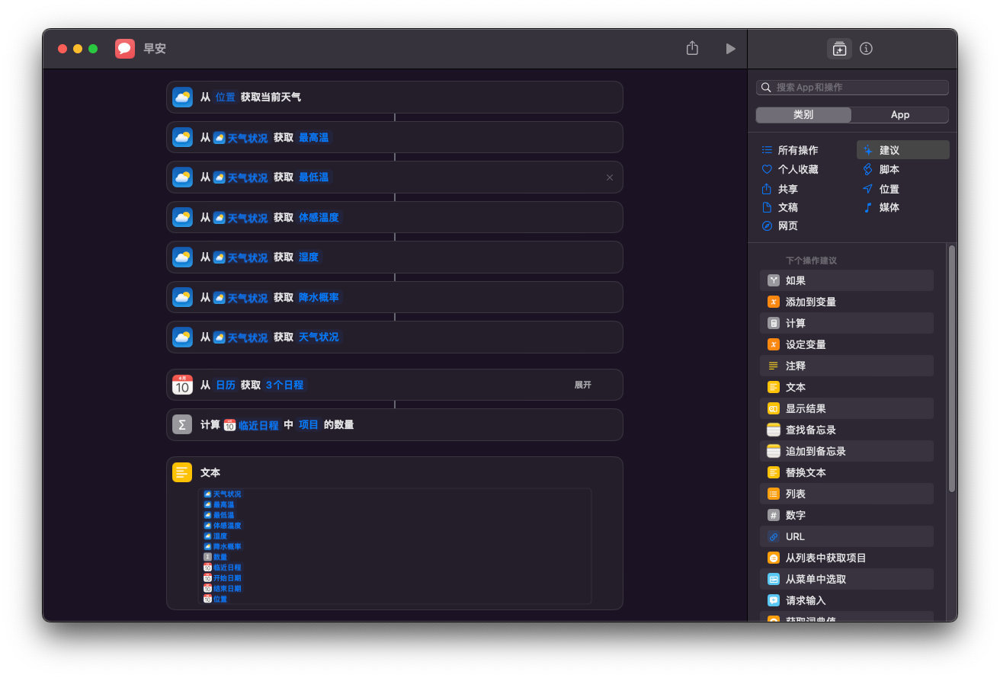
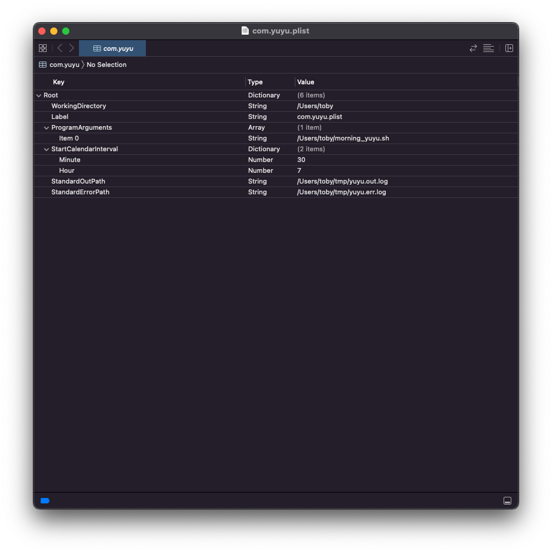

## 前言
目前版本还非常不完善，仅仅是达到了能用的程度。后续可能会持续更新。

## 用法
1. 前往[微信测试号平台](https://mp.weixin.qq.com/debug/cgi-bin/sandbox?t=sandbox/login)注册账号。
2. 把二维码发给你希望推送的人，让ta关注。
3. 添加一个测试模板，示例如下：
   ```text
   早上好！今天是：{{date.DATA}}
   
   {{greeting.DATA}}
   
   下面是今日{{city.DATA}}的天气播报(/^~^/)
   
   今天的天气：{{weather.DATA}}
   湿度：{{humidity.DATA}}
   最低气温：{{min_temperature.DATA}}
   最高气温：{{max_temperature.DATA}}
   体感温度：{{feeling_temperature.DATA}}
   降水概率：{{rain_probability.DATA}}
   
   提醒事项：
   {{reminders.DATA}}
   
   我们已经在一起{{love_day.DATA}}天啦
   距离***的生日还有{{birthday.DATA}}天
   距离{{festival_name.DATA}}还有{{festival_countdown.DATA}}天
   
   每日一言：{{motto.DATA}}
   ```
   具体填写规则参加微信说明。
   > 模版内容可以是任意内容，其中需要填入的参数就用 `{{xxx.DATA}}` 代替，其中 `xxx` 是参数名字。
4. 填写 `config_template.json` 并更名为 `config.json`。
5. `pip install -r requirments.txt` 安装依赖。
6. 运行 `main.py` 并手动输入天气信息和日历信息，即可发送信息。
   > 好吧我骗你的，手动输入确实太蠢了，我只是会运行一个快捷指令，然后通过管道把快捷指令的输出给这个 Python 程序了而已。
   > 快捷指令如下：
   > 
7. 写一个 `.sh` 的脚本，大约长这样：
   ```shell
   #! /bin/zsh
   echo `date`
   cd ${你的 main.py 所在目录的绝对路径}
   shortcuts run "${你的快捷指令的名字}" | ${你的 python 路径} main.py
   ```
8. 写一个 `.plist` 放在 `~/Library/LaunchAgents` 下，定时执行上面的脚本，大概长这样：
   > 
   > 
   > 出错的排查参见：[我的博客](https://toby-shi-cloud.github.io/posts/mac-launchctl-auto-background-task.html)
